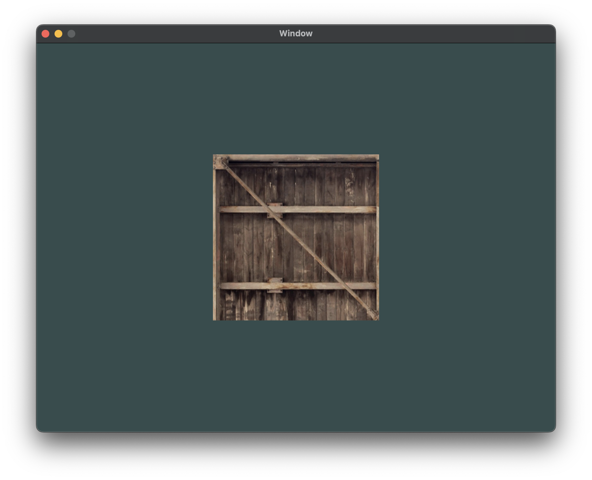
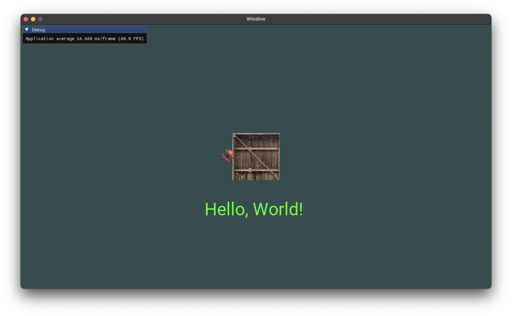
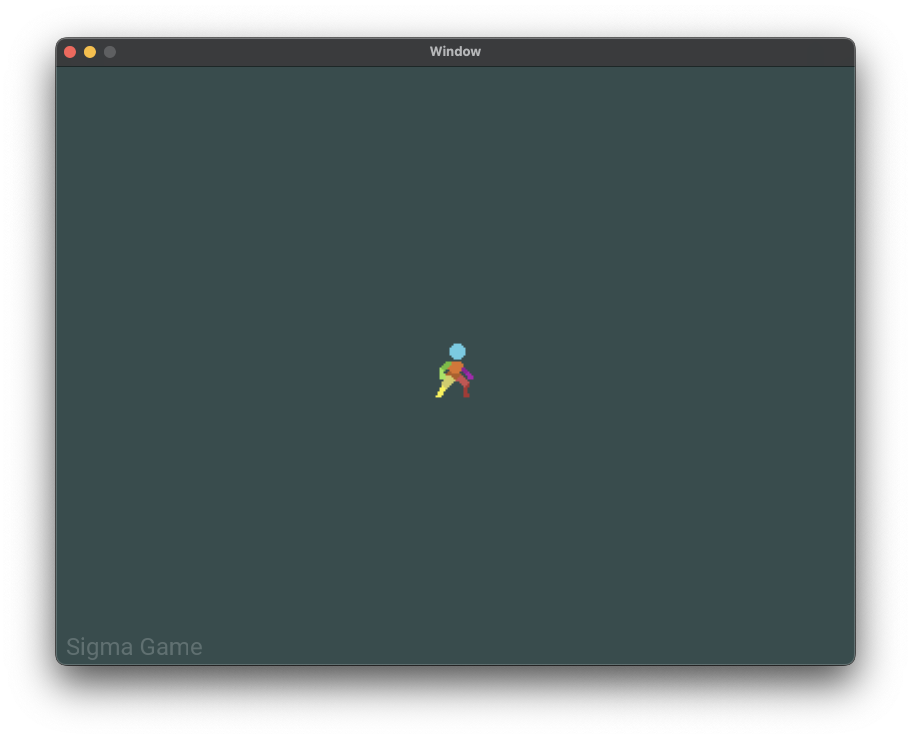
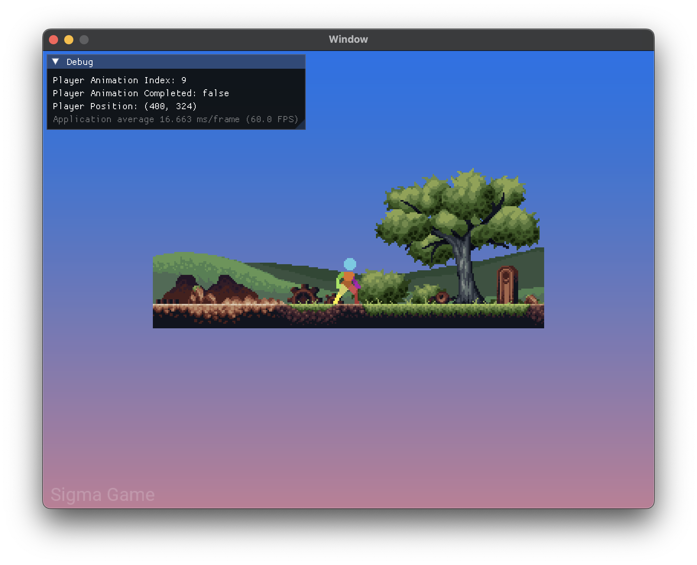

# Relic

## 2024-10-4

## 2024-10-11

## 2024-10-26

## 2024-11-01

## 2024-12-20

# Minimum Viable Product

- [ ] Window creation (GLFW/SDL2) and simple text rendering.
- [ ] Handle user input (keyboard/mouse) and display a basic text buffer.
- [ ] File handling (open, close, edit, save, etc.)
- [ ] Basic modern UI